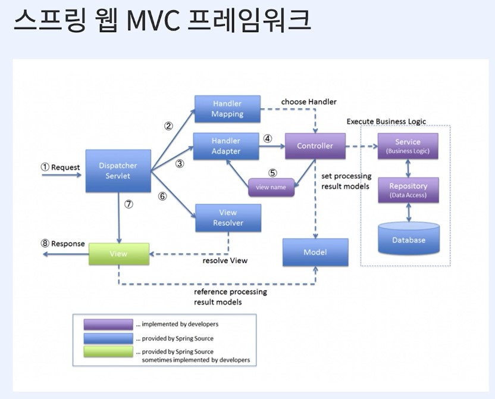
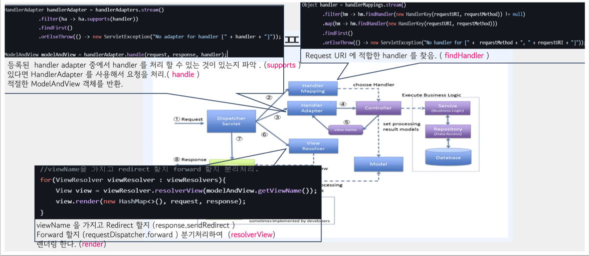

**DispatcherServlet** 
: 모든 Request 를 받는 부분. 
&ensp;&ensp;&ensp;src/main/java/org/example/mvc 
&ensp;&ensp;&ensp;&ensp;&ensp;&ensp;&ensp;&ensp;ㄴ DispathcerServlet.java

**HandlerMapping** 
&ensp;&ensp;&ensp;src/main/java/org/example/mvc 
&ensp;&ensp;&ensp;&ensp;&ensp;&ensp;&ensp;&ensp;ㄴ HandlerMapping.java : interface 
&ensp;&ensp;&ensp;&ensp;&ensp;&ensp;&ensp;&ensp;ㄴ HandlerKey.java : 경로 관련된 model 
&ensp;&ensp;&ensp;&ensp;&ensp;&ensp;&ensp;&ensp;ㄴ RequestMappingHandler.java : 요청경로에 대해 담는 부분.

**HandlerAdapter** 
: handler 를 적절한 Controller 를 찾아서 view name 을 응답해줌. 
&ensp;&ensp;&ensp;src/main/java/org/example/mvc 
&ensp;&ensp;&ensp;&ensp;&ensp;&ensp;&ensp;&ensp;ㄴ HandlerAdapter.java : interface 
&ensp;&ensp;&ensp;&ensp;&ensp;&ensp;&ensp;&ensp;ㄴ SimpleControllerHandlerAdapter.java : ControllerHandler 인지 체크. 
ModelAndView 반환. 

**ViewResolver** 
: view name을 ModelAndView 객체로 return 시킴. 
&ensp;&ensp;&ensp;src/main/java/org/example/mvc/view 
&ensp;&ensp;&ensp;&ensp;&ensp;&ensp;&ensp;&ensp;ㄴ ModelAndView.java : model 
&ensp;&ensp;&ensp;&ensp;&ensp;&ensp;&ensp;&ensp;ㄴ ViewResolver.java : interface 
&ensp;&ensp;&ensp;&ensp;&ensp;&ensp;&ensp;&ensp;ㄴ JspViewResolver.java : "redirect" 인 경우에는 RedirectView 로 return , 그 외의 경우에는 JspView 로 return 
&ensp;&ensp;&ensp;&ensp;&ensp;&ensp;&ensp;&ensp;ㄴ RedirectView.java : response.sendRedirect(...) 
&ensp;&ensp;&ensp;&ensp;&ensp;&ensp;&ensp;&ensp;ㄴ JspView.java : requestDispatcher.forward(...) 

